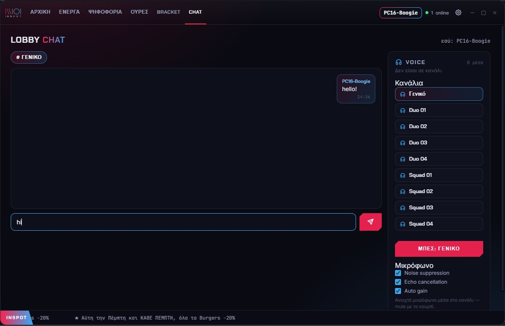
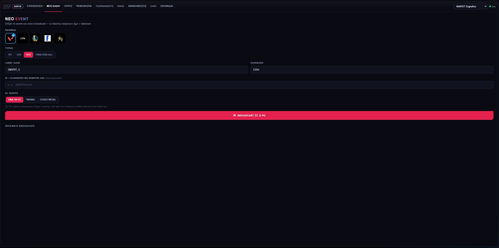
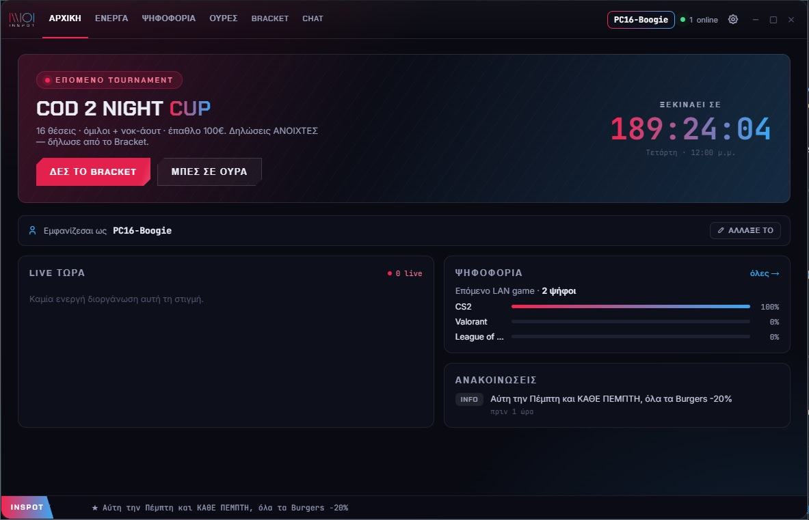
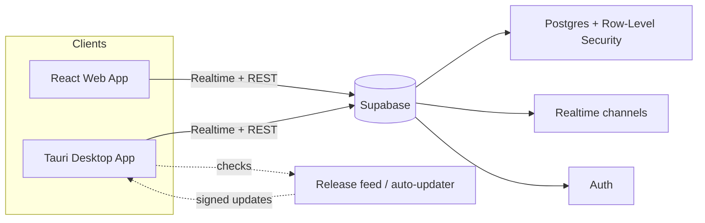

# 🏆 WNTG — Tournament & Venue-Management Platform

**Real-time, multi-tenant platform that runs live gaming tournaments across a franchise network — with a native desktop client and self-updating deployment.**

> 🔒 **Source is private** to protect business IP. This repo is a documented case study. I'm glad to walk through the codebase live in an interview.

---

## Screenshots

<!-- Drop images into /docs and update these paths -->
| Chat view | Admin panel | Desktop client |
|---|---|---|
|  |  |  |

---

## The problem

Running tournaments across several venues meant manual brackets, scattered sign-ups, and no single source of truth. Each location needed to manage its own events without seeing — or touching — another location's data.

## What it does

- **Player self-registration** with editable profiles and per-user voice controls
- **Admin bracket management** with a stacked **double-elimination** layout
- **Franchise isolation** — each venue sees only its own tournaments, players, and settings (multi-tenant, enforced at the database level)
- **Realtime updates** so brackets and registrations sync live across screens
- **Native desktop client** packaged with Tauri, delivered through a working **auto-updater** (shipped incremental releases to live machines)

## Architecture

- **Data isolation** is enforced with Postgres **Row-Level Security**, so tenancy is guaranteed by the database, not just the UI.
- **PII protection** on registration data — players expose only what's needed for a bracket.
- **Release pipeline** publishes signed desktop builds; clients check the feed and update themselves.

## Tech stack

**Backend:** Supabase (Postgres, Row-Level Security, Realtime, Auth)
**Front-end:** React · Vite · TypeScript
**Desktop:** Tauri (auto-updater pipeline)

## My role

Sole designer, builder, and operator — schema and RLS policies, the React app, the Tauri desktop packaging, the release/auto-update pipeline, and the multi-tenant model. Built for and used daily by a real venue network.
